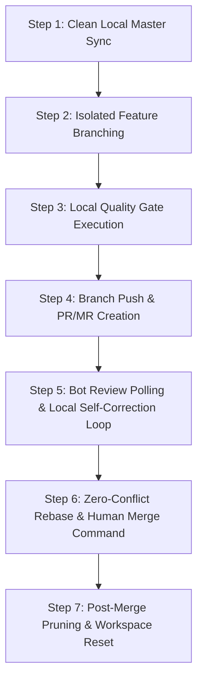

# End-to-End Pull Request & Bot Synergy SOP (GitHub & GitLab)

> **Governance Standard:** This document defines the absolute, end-to-end procedural workflow for managing Pull Requests (PRs on GitHub) and Merge Requests (MRs on GitLab). It establishes the exact command sequences, bot integration protocols, local self-correction loops, anti-looping safeguards, and post-merge cleanup mandates for human operators and AI agents (Google Antigravity, Google Jules, Cursor, GitHub Copilot).

---

## 1. Executive Summary & Core Philosophy

In modern AI-assisted software engineering, automated code review bots (e.g., CodeRabbit AI, SonarQube Cloud, Kody AI, CodeQL, GitLab Duo, Security Scanners) frequently generate comments, security alerts, and inline code suggestions on open pull/merge requests.

To maintain repository sovereignty and zero-defect quality gates without introducing infinite bot-to-bot conversational loops, this protocol establishes three unyielding operational principles:

1. **Human & Primary Cognitive Twin Sovereignty:** The Human Operator and the Primary Cognitive Twin (Antigravity) retain absolute, final authority over all PR approvals and merges. Automated bots serve strictly as advisory analyzers.
2. **Local Evaluation & Offline Correction:** All code suggestions from external bots must be fetched, evaluated, adapted, tested, and verified **locally** before pushing back to origin. Raw remote auto-commits by external bots into feature branches are prohibited without local verification.
3. **Anti-Looping Circuit Breakers:** The AI agent must never engage in multi-turn conversational ping-pong with external bots on the PR thread. Feedback is processed as a one-way batch loop: *Fetch Feedback $\rightarrow$ Fix & Test Locally $\rightarrow$ Single Re-push $\rightarrow$ Verify Quality Gate*.

---

## 2. Platform Architecture & CLI Tooling Matrix

This protocol natively supports both **GitHub** and **GitLab** platforms using official command-line interfaces.

| Phase / Operation | GitHub Standard (`gh`) | GitLab Standard (`glab`) |
| :--- | :--- | :--- |
| **Authentication Check** | `gh auth status` | `glab auth status` |
| **Branch Creation** | `git checkout -b feat/<name>` | `git checkout -b feat/<name>` |
| **Push Feature Branch** | `git push origin feat/<name>` | `git push origin feat/<name>` |
| **Create PR / MR** | `gh pr create --fill` | `glab mr create --fill` |
| **Inspect Bot Feedback** | `gh pr view <id> --json comments,reviews,statusCheckRollup` | `glab mr view <id> --show-comments` |
| **Check CI Status** | `gh run view <run_id> --log-failed` | `glab ci trace <job_id>` |
| **Merge PR / MR** | `gh pr merge <id> --rebase --delete-branch` | `glab mr merge <id> --rebase --remove-source-branch` |
| **Local Branch Pruning** | `git branch -D feat/<name>` | `git branch -D feat/<name>` |
| **Remote Tracking Prune** | `git remote prune origin` | `git remote prune origin` |

---

## 3. End-to-End Operational Lifecycle (7-Step Protocol)



---

### Step 1: Clean Local Master Sync
Before starting any new feature or fix, confirm that the local working tree is clean and synchronized with the upstream primary branch (`master` or `main`).

**GitHub & GitLab Command:**
```bash
git checkout master
git pull --rebase origin master
git status
```
*Requirement:* `git status` must report `working tree clean` and `branch is up to date with origin/master`.

---

### Step 2: Isolated Feature Branching
All development must occur in isolated, short-lived feature branches following semantic naming conventions (`feat/<description>`, `fix/<description>`, `docs/<description>`). Pushing directly to `master`/`main` is strictly forbidden.

**GitHub & GitLab Command:**
```bash
git checkout -b feat/add-security-headers
```

---

### Step 3: Local Quality Gate Execution
Prior to pushing any branch, run the full local audit suite (`composer lab-check`, `npm test`, or equivalent) to ensure 100% compliance.

**Command Example:**
```bash
# PHP Ecosystem
composer lab-check

# Node / Web Ecosystem
npm run test && npm run lint
```
*Requirement:* Zero test failures, zero static analysis errors, zero syntax warnings.

---

### Step 4: Branch Push & PR/MR Creation
Push the feature branch to `origin` and open a formal Pull Request or Merge Request using interactive or automated CLI flags.

**GitHub Command:**
```bash
git push origin feat/add-security-headers
gh pr create --fill
```

**GitLab Command:**
```bash
git push origin feat/add-security-headers
glab mr create --fill --remove-source-branch
```

---

### Step 5: Bot Review Polling & Local Self-Correction Loop

Once the PR/MR is submitted, external automated bots (e.g., CodeRabbit, SonarQube, CodeQL, Kody AI, GitLab Security Scanners) will run static analysis and leave feedback.

#### 5.1 Polling & Inspecting Bot Comments
Do NOT guess what bots reported. Fetch the structured JSON or thread output:

**GitHub Command:**
```bash
# Check PR comments, reviews, and CI status checks
gh pr view <PR_NUMBER> --json comments,reviews,statusCheckRollup

# If a CI job failed, view the exact failure logs
gh run view <RUN_ID> --log-failed
```

**GitLab Command:**
```bash
# Inspect MR comments and pipeline status
glab mr view <MR_NUMBER> --show-comments
glab ci status

# View failed pipeline logs
glab ci trace <JOB_ID>
```

#### 5.2 Anti-Looping Circuit Breaker Protocol
To prevent infinite bot-to-bot conversational loops:
1. **NO Direct Bot Tagging in Chat:** The Primary AI must NEVER post `@coderabbitai` or `@kody` comments in PR threads to argue or request chat responses.
2. **Local Batch Evaluation:** Treat all bot comments as a static batch of suggestions.
3. **Selective Adaptation:** 
   - Accept valid bug fixes, security patches, or formatting improvements.
   - Reject invalid suggestions or rate-limit warnings silently by proceeding with local tests.
4. **Offline Fix & Verification:** Apply selected code fixes **locally** in the IDE workspace.

**Local Correction Workflow:**
```bash
# Apply fixes locally on feature branch
# Re-verify local quality gate
composer lab-check

# Stage specifically modified files (NO blanket git add .)
git add src/Security/HeaderManager.php tests/SecurityTest.php

# Commit with semantic message
git commit -m "fix(security): resolve SonarQube hotspot & CodeRabbit array check"

# Push updated branch to origin
git push origin feat/add-security-headers
```
5. **Re-triggering Checks:** The push automatically updates the open PR/MR and triggers fresh bot checks without requiring conversational comments.

---

### Step 6: Zero-Conflict Rebase & Human Merge Command

Merging to `master`/`main` requires zero-conflict verification and human operator authorization.

#### 6.1 Defensive Pre-Merge Rebase
Rebase the feature branch against latest `master` to guarantee fast-forward zero-conflict integration.

```bash
git fetch origin
git rebase origin/master
```

#### 6.2 Execution of Merge Command

**GitHub Merge Command:**
```bash
# Rebase merge and delete remote branch on GitHub
gh pr merge <PR_NUMBER> --rebase --delete-branch
```

**GitLab Merge Command:**
```bash
# Rebase merge and remove source branch on GitLab
glab mr merge <MR_NUMBER> --rebase --remove-source-branch
```

---

### Step 7: Post-Merge Pruning & Workspace Reset (Rule 25 Compliance)

Immediately following a successful merge into `master`/`main`, the workspace must be returned to a single-branch state.

**GitHub & GitLab Post-Merge Commands:**
```bash
# 1. Switch back to master
git checkout master

# 2. Rebase local master with remote origin
git pull --rebase origin master

# 3. Delete local feature branch
git branch -D feat/add-security-headers

# 4. Prune remote tracking references
git remote prune origin

# 5. Verify pristine single-branch topology
git branch -a
```
*Expected Output of `git branch -a`:*
```
* master
  remotes/origin/HEAD -> origin/master
  remotes/origin/master
```

---

## 4. Bot Interaction Rules & Troubleshooting Matrix

| Issue / Scenario | Root Cause | Mandated Solution |
| :--- | :--- | :--- |
| **Bot Rate Limit Warning** (`Review limit reached`) | API quota exhausted on external bot platform. | Do not wait endlessly. Verify code locally via Pest/PHPStan and proceed with human approval. |
| **Inline Script Parse Error in CI** | Quotes/vars escaped differently between Windows PowerShell & Linux Bash. | Enforce **Rule 26**: Extract inline logic to `tools/script.php` and invoke cleanly. |
| **Merge Conflict on PR/MR** | Target `master` branch moved ahead during feature development. | Run `git fetch origin && git rebase origin/master` locally, resolve conflicts, and re-push feature branch. |
| **CLI Authentication Failure** (401/403 Error) | Account token expired or incorrect target organization context. | Run `gh auth status` / `glab auth status` and prompt user to login with matching account credentials. |
| **Orphaned Remote Branches** | Remote branch was not deleted during PR merge. | Execute `git push origin --delete <branch_name>` followed by `git remote prune origin`. |

---

## 5. Summary Checklist for Human & AI Operators

- [ ] Local `master` synchronized before branching (`git pull --rebase origin master`).
- [ ] Dedicated feature branch created (`git checkout -b feat/<name>`).
- [ ] Edits verified locally via `composer lab-check` (or `npm test`).
- [ ] PR/MR created via `gh pr create --fill` or `glab mr create --fill`.
- [ ] Bot comments inspected via CLI (`gh pr view` / `glab mr view`).
- [ ] Suggestions fixed and verified **locally** (zero anti-pattern bot loops).
- [ ] Feature branch re-pushed and re-verified against CI Quality Gates.
- [ ] PR/MR merged using `--rebase` option.
- [ ] Local feature branch deleted (`git branch -D <name>`).
- [ ] Remote tracking references pruned (`git remote prune origin`).
- [ ] Local working tree verified clean with `master` as sole branch (`git branch -a`).

---
*Deep State of Mind (DSOM) Governance Architecture | Harisfazillah Jamel (LinuxMalaysia) | 2026-08-01*
*Standard: UK English | DBP-standard Bahasa Melayu Malaysia (Piawai) | GNU General Public License v3.0*


---
*Deep State of Mind (DSOM) For My AI Protocol | Harisfazillah Jamel (LinuxMalaysia) | 2026-08-01*
*Standard: UK English | DBP-standard Bahasa Melayu Malaysia (Piawai) | GNU General Public License v3.0*
